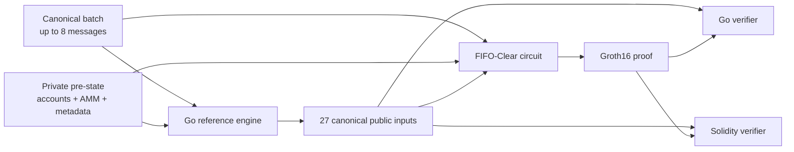

# FIFO-Clear

FIFO-Clear is a deterministic batch-clearing prototype whose state transition is implemented twice: as a Go reference engine and as a BN254 Groth16 circuit verified in Go and Solidity.

> **Status:** the technical prototype is complete at `prototype-v0.1`. It demonstrates the protocol and proof path end to end, but it is not a production exchange or rollup.

## Why this exists

Order matching becomes ambiguous when funding order, partial fills, AMM liquidity, price ties, and integer boundaries interact.

FIFO-Clear defines one canonical result for a batch. The Go engine provides readable reference semantics. The circuit independently proves that the same transition was executed without revealing the pre-state or batch.

The prototype answers one question:

> Can a fixed batch of deposits and orders produce a deterministic state transition that is independently constrained and verified on-chain?

## How a batch clears

Each batch contains one to eight canonical messages. A message is either a deposit or a limit order. Messages outside the real-message prefix must be canonical zero values.

The transition runs in this order:

1. Validate the batch, sequence IDs, metadata chain, field ranges, and global liability caps.
2. Process deposits and reserve order funds in slot order.
3. Mark underfunded orders as rejected without changing their economic state.
4. Evaluate the limit tick of every active order as a clearing candidate.
5. Combine eligible BUY and SELL liquidity with the maximum valid AMM residual.
6. Select one clearing tick with the deterministic tie-break rules.
7. Allocate fills in strict slot-order FIFO.
8. Settle at the clearing price, refund unused reservations, update the AMM and metadata, and rebuild the state root.

For a candidate tick, `M` is internally matched base and `A` is AMM-filled base:

```text
F = 2 × M + A
```

Candidates are ranked by:

1. highest executable base `F`
2. highest internal match `M`
3. smallest distance from the pre-batch AMM spot price
4. lowest tick

The AMM fill is the largest integer residual that stays within reserve bounds and preserves the constant-product invariant:

```text
postBase × postQuote >= preBase × preQuote
```

## From messages to a verified proof



The engine supplies expected public values to the witness builder. It does not supply a private execution trace to the circuit.

The circuit recomputes batch validity, both commitments, the complete transition, and every public trace value from the private pre-state and batch.

## What the proof binds

The circuit has 87 explicit private inputs:

- 20 pre-state fields: eight account balance pairs, two AMM reserves, and two metadata counters
- 67 batch fields: three header fields and eight fixed message unions

It exposes exactly 27 public inputs:

| Group | Count | Values |
|---|---:|---|
| Batch header | 2 | batch index, message count |
| Commitments | 2 | high and low 128-bit halves of the batch commitment |
| State roots | 2 | old root, new root |
| Clearing result | 1 | clearing tick |
| Per-slot funding | 8 | funding status for each slot |
| Per-slot execution | 8 | filled base amount for each slot |
| Aggregate trace | 4 | internal match, requested residual, AMM direction, AMM fill |

The canonical order lives only in [`internal/publicinputs`](internal/publicinputs/public_inputs.go).

The production circuit contains 544,654 constraints with the pinned toolchain. The count is reported every time `make production-proof` runs.

## Commitments and state

### Canonical batch commitment

Every batch has one 249-byte fixed-width, big-endian encoding compatible with Solidity `abi.encodePacked`:

```text
bytes32 batchDomainSeparator
uint64  batchIndex
uint64  startSequenceId
uint8   messageCount
8 × (
  uint8  messageType
  uint64 sequenceId
  uint8  accountId
  uint8  tokenId
  uint64 depositAmount
  uint8  side
  uint32 baseAmount
  uint8  limitTick
)
```

The commitment is Legacy Keccak-256. Its first and last 16 bytes become the two public commitment values.

### Poseidon2 state tree

The state is a depth-4 tree with 16 leaves:

- leaves `0..7`: eight accounts
- leaf `8`: AMM reserves
- leaf `9`: processed batch and message counts
- leaves `10..15`: index-bound empty leaves

Poseidon2 hashing uses explicit domains for account, AMM, metadata, empty, and internal nodes. Leaf indexes and internal-node levels are part of their preimages.

## Milestones

| Milestone | Result |
|---|---|
| M0 | BN254 Groth16, Go verification, Solidity export, and Anvil toolchain spike |
| M1 | Canonical protocol types, encoding, Keccak commitment, Poseidon2 state tree, and golden vectors |
| M2 | Deterministic Go engine with funding, clearing, AMM residuals, FIFO settlement, and conservation |
| M3 | Independent production circuit, adversarial tests, Groth16 proof generation, and Solidity verification |

The M0 circuit remains in the repository as a small toolchain-only example. It does not implement FIFO-Clear.

## Run the prototype

### Requirements

- Go 1.26.1
- gnark 0.14.0 and gnark-crypto 0.19.0 through Go modules
- Foundry 1.7.1
- Solidity 0.8.35
- `go`, `forge`, `cast`, `anvil`, and `jq` on `PATH`

Versions are pinned in `go.mod`, `.go-version`, `.foundry-version`, and `foundry.toml`.

### Complete regression suite

```bash
make test
```

### Generate and verify a production proof

```bash
make production-proof
```

This compiles the circuit, performs a disposable Groth16 setup, creates a witness and proof, verifies it in Go, rejects a tampered public input, and exports a Solidity verifier.

### Verify the proof on local Anvil

```bash
make test-production-anvil
```

This deploys the generated verifier, accepts the valid proof, then mutates each of the 27 public inputs and requires every modified call to fail.

All generated R1CS, keys, witnesses, proofs, Solidity verifiers, calldata, Foundry output, and Anvil logs are ignored disposable artifacts.

## Useful commands

| Command | Purpose |
|---|---|
| `make test` | Run every Go test, including both proof pipelines |
| `make test-engine` | Test clearing, AMM, settlement, and tracked engine vectors |
| `make test-primitives` | Test protocol encoding, hashing, state, and primitive vectors |
| `make test-circuit` | Test circuit constraints, adversarial cases, Groth16, and the Solidity ABI |
| `make test-solidity-primitives` | Compare Solidity encoding and commitments with tracked Go vectors |
| `make generate-vectors` | Explicitly regenerate protocol golden vectors |
| `make generate-engine-vectors` | Explicitly regenerate engine showcase vectors |
| `make proof-spike` | Run the small M0 toolchain-only proof |
| `make production-proof` | Generate and verify the complete FIFO-Clear proof |
| `make test-anvil` | Verify the M0 spike on local Anvil |
| `make test-production-anvil` | Verify the production proof and all public-input mutations on Anvil |

Normal tests never rewrite tracked golden files.

## Correctness strategy

The test suite combines several kinds of evidence:

- tracked protocol and two-batch engine golden vectors
- hand-authored literal showcase balances, roots, commitments, fills, and trace values
- an independent bounded AMM oracle covering 185,220 deterministic combinations
- exact global-liability cap and full-width integer boundary cases
- real-order fixtures for all four clearing tie-break layers
- underfunded BUY and SELL no-op tests
- bounded engine/circuit differential tests
- mutation tests for every explicit public and private input
- native Groth16 verification and Solidity verification on Anvil
- rejection of all 27 individually modified public inputs

These tests are strong regression evidence, not a formal proof of the gnark, Groth16, or Solidity implementations.

## Repository map

```text
cmd/production-proof       production proof command
contracts/                 Solidity harnesses and generated verifier target
internal/circuit/          independent FIFO-Clear constraints
internal/engine/           deterministic Go reference transition
internal/productionproof/  Groth16 and Solidity artifact pipeline
internal/protocol/         canonical messages, validation, and encoding
internal/publicinputs/     sole definition of the 27-input order
internal/state/            Poseidon2 leaves and Merkle tree
testdata/                  tracked protocol and engine vectors
```

## Prototype boundaries

This repository demonstrates a complete technical proof path. It intentionally does not include:

- a production inbox or data-availability layer
- token custody, deposits, withdrawals, or user accounts
- persistent proving-key management or a trusted-setup ceremony
- an operator service, database, API, wallet, or user interface
- testnet or mainnet deployment
- production security guarantees

`make production-proof` performs a fresh disposable setup. That is suitable for this prototype, but not for a deployed system that must keep one verifier and proving key across many batches.
